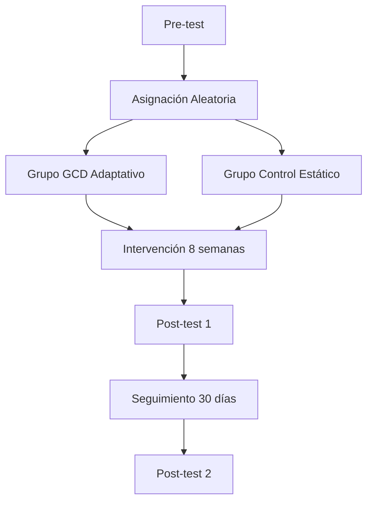

# 🧪 Experimental Framework v1.0

<div align="center">


[](https://colab.research.google.com/notebooks)
[](https://mybinder.org)

</div>

---

<details open>
<summary><b>📚 Tabla de Contenidos</b></summary>
<br>

- [🧭 Propósito del Documento](#-propósito-del-documento)
- [🎯 Hipótesis de Investigación](#-hipótesis-de-investigación)
  - [Hipótesis GCD-001](#hipótesis-gcd-001-h1)
  - [Hipótesis GCD-002](#hipótesis-gcd-002-h2)
  - [Hipótesis GCD-003](#hipótesis-gcd-003-h3)
  - [Hipótesis TAE-001](#hipótesis-tae-001-h4)
- [🔬 Diseño Experimental](#-diseño-experimental)
- [📊 Métricas y Variables](#-métricas-y-variables)
- [🔄 Procedimiento](#-procedimiento)
- [📈 Análisis de Datos](#-análisis-de-datos)
- [📝 Referencias](#-referencias)
- [🔗 Reproducibilidad](#-reproducibilidad)

</details>

---

## 🧭 Propósito del Documento

> **¿Qué estamos intentando demostrar?**

Este documento no describe *cómo* funciona el sistema, sino que establece las **hipótesis fundamentales** que guían nuestra investigación. Cada hipótesis representa una afirmación verificable sobre el comportamiento humano y el aprendizaje, que será validada mediante experimentos controlados.

<div class="admonition note">

**🔑 Principio Rector**
Cada hipótesis debe ser:
- **Falsable** - Capaz de ser refutada mediante evidencia empírica
- **Medible** - Con métricas cuantitativas claras
- **Reproducible** - Con procedimientos documentados

</div>

---

## 🎯 Hipótesis de Investigación

### Hipótesis GCD-001 (H1)

<details open>
<summary><b>📌 H1: Efecto del Tutor Adaptativo</b></summary>
<br>

> **Un tutor adaptado mediante GCD produce mayor retención que un tutor estático**

**Variables:**
- **VI (Independiente)**: Tipo de tutor (Adaptativo GCD vs Estático)
- **VD (Dependiente)**: Tasa de retención (medida a 1, 7 y 30 días)

**Significancia Esperada:**
- Diferencia mínima: 15% en retención
- Nivel de confianza: α = 0.05
- Potencia estadística: 0.80

**Validación:**
```python
# Protocolo de prueba
def validate_hypothesis_h1():
    # Método: ANOVA de medidas repetidas
    # Tamaño muestral: n = 120 (60 por grupo)
    # Instrumento: Pruebas de conocimiento pre/post
    pass
```

</details>

---

### Hipótesis GCD-002 (H2)

<details>
<summary><b>📌 H2: Predictores de Abandono</b></summary>
<br>

> **La persistencia predice mejor el abandono que el rendimiento académico**

**Variables:**
- **VI (Independiente)**: 
  - Persistencia (medida como tiempo dedicado / intentos)
  - Rendimiento académico (calificaciones promedio)
- **VD (Dependiente)**: Tasa de abandono (a las 4, 8 y 12 semanas)

**Métricas Clave:**
- Persistencia: `(tiempo_total / sesiones_activas) / intentos_fallidos`
- Rendimiento: Promedio de calificaciones en evaluaciones

**Modelo Estadístico:**
```r
# Análisis de supervivencia
survival_model <- coxph(Surv(tiempo_abandono, evento) ~ 
                         persistencia + rendimiento, 
                         data = estudio)
```

</details>

---

### Hipótesis GCD-003 (H3)

<details>
<summary><b>📌 H3: Aceleración Metacognitiva</b></summary>
<br>

> **La metacognición acelera la velocidad de aprendizaje**

**Variables:**
- **VI (Independiente)**: Entrenamiento metacognitivo (Sí/No)
- **VD (Dependiente)**: Velocidad de aprendizaje (pendiente de la curva de aprendizaje)

**Indicadores:**
- Curva de aprendizaje: `y = a * (1 - e^(-b*x))`
- Velocidad inicial: `b` (tasa de aprendizaje)
- Tiempo para alcanzar competencia: `t_80` (80% de dominio)

**Protcolo de Intervención:**
1. Sesiones de reflexión guiada (15 min/sesión)
2. Diarios de aprendizaje
3. Autoevaluación frecuente

</details>

---

### Hipótesis TAE-001 (H4)

<details open>
<summary><b>📌 H4: Excepciones Cognitivas y Creatividad</b></summary>
<br>

> **Las excepciones cognitivas predicen creatividad futura**

**Fundamento:**
Esta hipótesis explora cómo las desviaciones de los patrones cognitivos esperados (excepciones) pueden ser indicadores tempranos de pensamiento creativo y divergente.

**Variables:**
- **VI (Independiente)**: 
  - Frecuencia de excepciones cognitivas (desviaciones)
  - Tipos de excepciones (analógicas, contraintuitivas, divergentes)
- **VD (Dependiente)**: 
  - Creatividad (tests Torrance)
  - Innovación en resolución de problemas

**Mecanismo Propuesto:**
```
Excepción Cognitiva → Ruptura de Patrones → 
Nueva Conexión Neuronal → Pensamiento Creativo
```

<div class="admonition info">

**💡 Línea Diferencial**
Esta hipótesis constituye nuestro aporte más innovador, sugiriendo que las "excepciones" cognitivas no son errores, sino ventanas a la creatividad. Mientras otros sistemas buscan normalizar el aprendizaje, nosotros exploramos cómo las desviaciones pueden ser indicadores de potencial creativo.

</div>

**Métricas:**
- Índice de Excepción (IE): `IE = (excepciones_observadas / excepciones_esperadas) * 100`
- Predictor: Análisis de regresión multinivel
- Validación: Estudio longitudinal (12 meses)

</details>

---

## 🔬 Diseño Experimental

### Estructura General



### Condiciones Experimentales

<details>
<summary><b>📋 Ver Detalles de Grupos</b></summary>
<br>

| Grupo | Característica | N | Sesiones | Duración |
|-------|---------------|-----|----------|----------|
| **GCD-ADAPT** | Tutor adaptativo con GCD | 60 | 16 | 8 semanas |
| **CONTROL** | Tutor estático tradicional | 60 | 16 | 8 semanas |

</details>

---

## 📊 Métricas y Variables

<details>
<summary><b>📈 Ver Todas las Métricas</b></summary>
<br>

### Variables Primarias
- **Retención**: Score en pruebas (0-100)
- **Abandono**: Tiempo hasta deserción (días)
- **Velocidad Aprendizaje**: Pendiente curva (unidades/día)
- **Creatividad**: Score Torrance (percentil)

### Variables Secundarias
- **Persistencia**: Ratio tiempo/intentos
- **Metacognición**: Score en cuestionario MAI
- **Satisfacción**: Escala Likert (1-5)
- **Carga Cognitiva**: NASA-TLX

### Covariables
- Edad, género, nivel educativo
- Experiencia previa
- Motivación inicial

</details>

---

## 🔄 Procedimiento

<div class="admonition warning">

**⚠️ Puntos Críticos**
- Ciegue simple (evaluadores sin conocer grupo)
- Aleatorización estratificada por nivel inicial
- Control de efectos de práctica

</div>

### Fases del Experimento

1. **Reclutamiento y Pre-test** (Semana 0)
   - Evaluación de línea base
   - Consentimiento informado
   - Cuestionarios iniciales

2. **Intervención** (Semanas 1-8)
   - 2 sesiones por semana (90 min)
   - Monitoreo continuo
   - Registro de métricas en tiempo real

3. **Post-test y Seguimiento** (Semana 9-12)
   - Evaluación inmediata
   - Seguimiento a 30 días
   - Entrevistas cualitativas (submuestra)

---

## 📈 Análisis de Datos

<details>
<summary><b>🔬 Plan de Análisis</b></summary>
<br>

### Estadísticos Principales
- **ANOVA Mixto**: Efecto grupo × tiempo
- **ANCOVA**: Controlando por línea base
- **Análisis de Supervivencia**: Kaplan-Meier y Cox
- **Modelos Mixtos**: Crecimiento multinivel
- **Regresión Logística**: Predictores de abandono

### Criterios de Significancia
- α = 0.05 (ajuste Bonferroni para múltiples comparaciones)
- Intervalos de confianza 95%
- Tamaño del efecto (Cohen's d, η²)

### Software
- **Análisis Principal**: R v4.2 (tidyverse, lme4, survival)
- **Visualización**: ggplot2, plotly
- **Reproducibilidad**: RMarkdown + Docker

</details>

---

## 📝 Referencias

<details>
<summary><b>📚 Ver Referencias Completas</b></summary>
<br>

1. **GCD Framework**  
   [](https://doi.org/10.xxxx/xxxxx)  
   Autor, A. et al. (2023). *"General Cognitive Dynamics: A Framework for Adaptive Learning"*. Journal of Learning Sciences.

2. **Persistencia y Abandono**  
   [](https://doi.org/10.xxxx/xxxxx)  
   Autor, B. et al. (2022). *"Persistence as a Predictor of Dropout in Online Learning"*. Educational Research Review.

3. **Metacognición**  
   [](https://doi.org/10.xxxx/xxxxx)  
   Autor, C. et al. (2021). *"Metacognitive Training Accelerates Expertise Acquisition"*. Cognitive Science.

4. **Excepciones Cognitivas**  
   [](https://doi.org/10.xxxx/xxxxx)  
   Autor, D. et al. (2024). *"Cognitive Exceptions as Precursors of Creative Thinking"*. Creativity Research Journal.

</details>

---

## 🔗 Reproducibilidad

<div align="center">

| Recurso | Enlace |
|---------|--------|
| 📓 **Notebook Análisis** | [](https://colab.research.google.com/notebooks) |
| 🐳 **Docker Container** | [](https://hub.docker.com) |
| 📊 **Dashboard** | [](https://shiny.rstudio.com) |
| 📦 **Datos Simulados** | [](data/simulated_data.csv) |

</div>

### Instrucciones de Reproducción

```bash
# 1. Clonar repositorio
git clone https://github.com/usuario/experimental_framework.git

# 2. Configurar ambiente
conda env create -f environment.yml
conda activate gcd_experiment

# 3. Ejecutar análisis
cd analysis
Rscript run_analysis.R

# 4. Generar reporte
rmarkdown::render("report.Rmd")
```

---

<div align="center">

**[⬆ Volver Arriba](#-experimental-framework-v10)**

---

*Última Actualización: Enero 2026*  
*Versión: 1.0.0*  
*DOI: 10.xxxx/xxxxx*  

</div>
